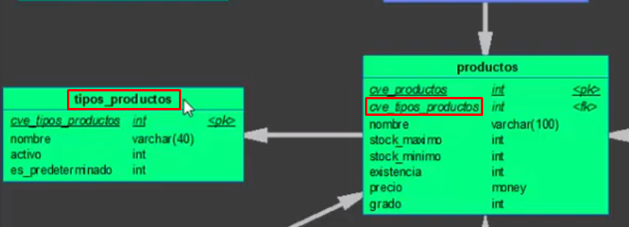
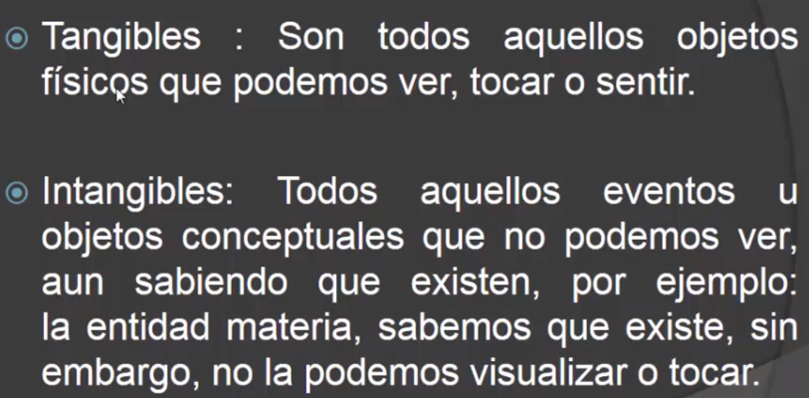
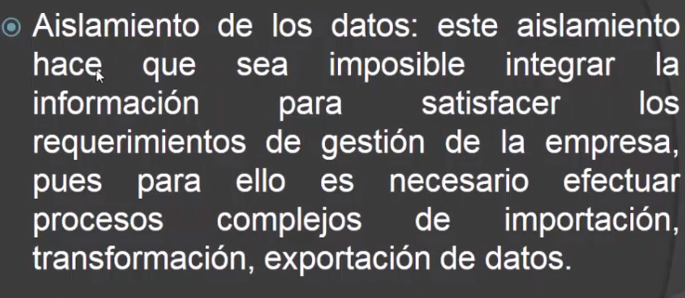
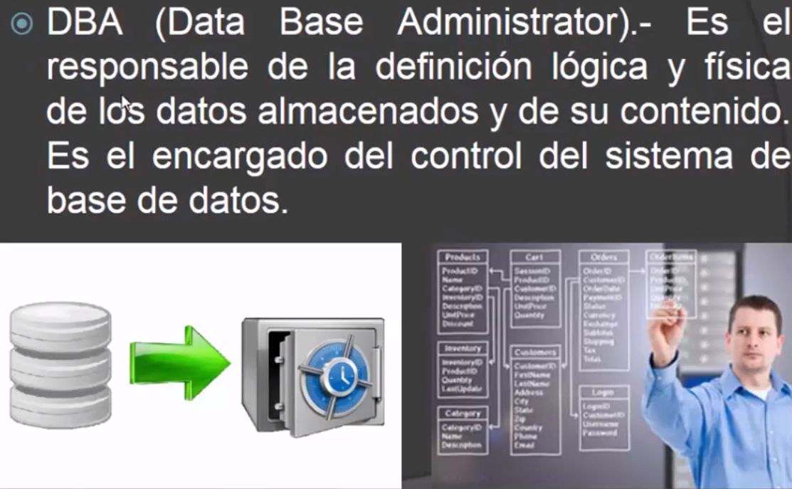

# Curso de Base de datos
Creado por Barrera Peña Víctor Miguel

---

# Recursos usados

- Curso de base de datos del profesor [Octavio Sanchéz](https://www.youtube.com/watch?v=q1FSrzQFsZ4&list=PLDfNoDGK4AHpkZihIhXcxrW056JyajVuW)
- Curso de base de datos del profesor [Ing. Jorge Campos]()


---

# ¿Qué es una base de datos?


---

# Piramide de ETo

- Estratégico: (gerentes, dueños) Se encargan de tomar las decisiones más importantes de la compañia.
- Táctico: (Gerente regional, subdirectores) Toman la decisión , no las más importantes, pero tienen a su cargo un número significativo de personal. En fin, son los que tienen mayor interacción con el cliente. 
- Son los que tiene mayor interacción con la base de datos, supongamos en una escuela, son los profesores, ya que ellos registran las calificaciónes de los alumnos. En el caso de una tienda , son las cajeras que registran las compras y aquellos de almacen que dicen que se introduce y como esta abastecido.

---

## ¿Qué es la piramide ...?

Es una representación gráfica de como se representa una institución o un organismo.


En ella se observa a el lado derecho, posibles cargos de acuerdo al nivel.

---

# Caracteristicas de las bases de datos

Ahora veamos que es cada una.

---

## Unicidad


**Explicación** La izquierda esta mal porque Dos registros tienen exactamente los mismos valores en todos los campos, mientras que en el de la derecha las matriculas difieren y con ello los registros no son iguales.

---

# Consistencia


---

**Ejemplo**


---

Haciendole zoom



Vemos que **Productos** depende de **tipos de productos** , quiere decir que sin una no puede existir la otra, en ello consiste **consistencia**.

Datos huefanos =datos sueltos

---

# Seguridad


---

# Privacía


---

Ejemplo: 

1. Facebook: Es una aplicación que la mayoría utilizamos, aunque todos accedemos a un perfil especifico , sólo yo puedo ver lo mio y no puedo acceder a a la información de alguien más.
2. El banco: Yo tengo un ahorro ahi, sólo yo puedo sacarlo o quien yo designe que puede, cada uno tiene su cueta independiente, y tiene reglas de solo poder sacar dinero en un horario determinado.


---

# Disponibilidad


---

## ¿Cómo lograrlo?

- Usando discos duros de respaldo.
- Dividiendo la información y lograr recuperala de otras fuentes.
- otras.


---

# Integridad


---

**Ejemplos:**
- Si yo pido 200 pesos en el banco , los 200 se me tienen que entregar, eso lo cumpliría , guardando el banco información de a que hora se llevo a cabo la información , donde y toda información para en caso de que yo me enojará el banco puede comprobar que 

> El dinero llego **integro** a mis manos


---

# ¿Qué es un base de datos?


---

# Entidades

La información que vamos a guardar dentro de un base de datos , le llamamos entidad.


---

## Tipos de entidades




---

Intangibles, son aproximadamente entidades abstractas, de una botella de un refresco, no podemos tocar la marca, pero sabemos que existe.

Se van a registrar todos las características necesarias para un fin.


---

# Beneficios de la base de datos


---


---


---


---

# ¿Qué es la redundacia de los datos?


---


---


---



---


---

# A que se refiere con procesamiento de archivos

Si antes de que existieran la bases de datos, todos se guardaba por ejmplo en archivos .txt con la información de los clientes o cuentas, más o menos como cuando empiezas con programas básicos donde requieres guardar la información , ya que al  iniciar de nuevo el programa requieres que este conozca la información de la ultima sesión.

---

# Actores de sistemas de base de datos


A los actores tambien se les llama usuarios.

---



---

## Usuario Programador


---

## Usuario Final 


No tiene conocimiento de como funciona, solo ya usan una aplicación que ha creado el programador

---

# Características  del sistema administrador de base de datos (SABD - DBMS)

DBMS= Data Base Manager System
- Sistema gestor de Base de datos
- Sistema administrador

---


---


---

# Estructura global de un sistema de base de datos


---


---

# Gestor de archivos


---

# Manejador de bases de datos


---

# procesador de consultas


---

A que se refiere con más eficiente, a que va  a convertirlo de la manera más eficiente para  darle la instrucción a la base de datos y de igual manera para regresar la información.

---

# Compilador de DDL 


---

#  Archivo de datos


---

#  Diccionario de datos


Contiene las definiciones de quet tipo variable se trata, que almacena , como actua, puede que un lugar se comporte como llave y en otro como otra cosa.

---

# Indíces


Se refiere a las llaves primarias y foraneas, ya que nos ayudan a identificar  elementos especificos.


---

# Objetos de una base de datos


---

# Sistema Manejador de base de datos (DBMS)


Esta es la representación de un DBMS , ya que las entradas y salidas de una base de datos no se hacen directamente.

---


---

#  C2

[video](https://www.youtube.com/watch?v=fwsbCl1EFtM&list=PLDfNoDGK4AHpkZihIhXcxrW056JyajVuW&index=2)

---

# Diseño Conceptual


---


- Perspectiva $\rightarrow$ Para que se quieren usar
- Naturaleza $\rightarrow$  Entero, decimal , cadena
- Uso $\rightarrow$ cual es el objetivo de registrar el dato

---

## Pasos para diseñar conceptualmente


---

### 1 Indentificar las entidades


---

### Paso 2 Identificar las relaciones


El profesor **imparte clases** a los alumnos
El cliente **compra** productos

Ninguna entidad puede quedar aislada.

Lo que esta **subrayado** es la relación entre entidades.

---

### Paso 3 Identificar atributos y asociarlos a entidades y relaciones


Atributos=propiedades

---

La entidad hombre tiene propiedades

- nombre
- edad
- estatura

Hay ocasiones en que un atributo puede llegar a convertirse en otra entidad, si necesitas ser más espcificos en campos que se repite.

> Si por ejemplo registraras muchas veces productos de una cierta marca y estas narcas tuvieran codigigos, sub categorias de productos , tendrías que posiblemente crear otra entidad, esto se define de acuedo al cliente y las reglas de negocio.


---

### Paso 4 Determinar los dominos de los atributos


Se refiera a los posibles valores que puede tomar el atributo.
**E.g** si es la edad, pues posiblemente, tenga que tener más de 18 para registrase.

Tambien se llama ambito.

---

### P 5 Determinarlos identificadores


Todo elemento tiene que tener un identificador único, para que no se confunda con otro.


**E.g**  Un humano tiene una Curp, si dijeras el nombre, no podría ser por que puede haber 2 personas llamadas igual, pero si dices que posiblemente 2 personas de diferentes paises tiene la misma curp.
En la escala global hay otra manera de identificación que sea un numero de la nacionalidad + tu curp y otras cosas que hacen que no sean iguales .

---
**E.g** Tú matricula como alumno puede ser un identificador.

#### Tipos 
Simples 
Compuestas: Formadas por más de un atributo **E.g.** `nombre + cuenta_id`

#### Excepciones

Hay ocasiones en que la entidad no tenga un **identificador natural** , por ello nosotros tenemos que diseñar uno.

---

**E.g.** 50  cosas de una caja se quieren poner en una base de datos , ninguno tiene un identificador nativo (natural) por ello creamos una enumerador que aumenta cada vez que sacamos una cosa de la caja. 

Sus **id´s** quedarian así
```
cosa_01
cosa_02
cosa_03
...
cosa_50
```

---

#### Conveciones

**E.g.** Si tú lo llamas **pelota** yo le digo **esfera bota** y otra persona le llama **boloide** pues al ver una base de datos con dichos nombres nos vamos a confundir, por ello te propongo  poner un nombre especifico con el cual los 3 le llamameos a esto le llamamos **convención**.

Las convenciones en los identificadores son `nombreLlave_id` o `nombreLlave_cv` 

**E.g**
```sql
rfc_id

matricula_id
```

---

###


Va de la mano con normalización, donde es el proceso donde la base de datos se va fracmentando.

---

### 


- Power Designer

Sirve para muchos diagramas
Coversión entre diarramas fisicos y dicates
fiicos y conceptuales
conversion entre diagramas fisicos y conceptuales.
Dagramas de caso de uso
etc


---

### 


En caso de haber detalles pues volver al paso 1 para pulirlo
o cuando se tienen que agregar mejoras
- Crecimiento (siempre dejar la posibilidad) 
  - Comunmente se llaman **varillas** en caso de que se necesiten construir más la varillas se dejan ahi por si las dudas.


